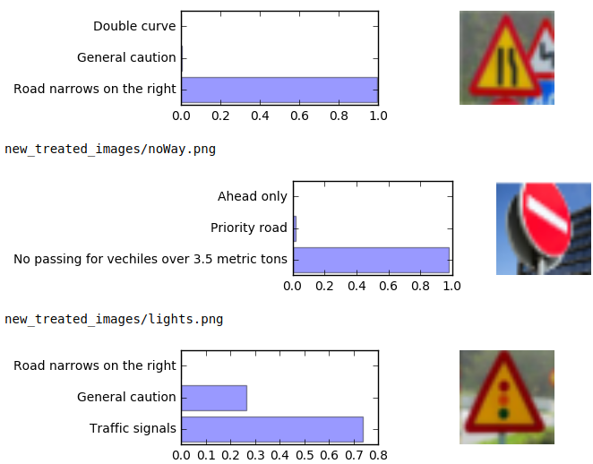
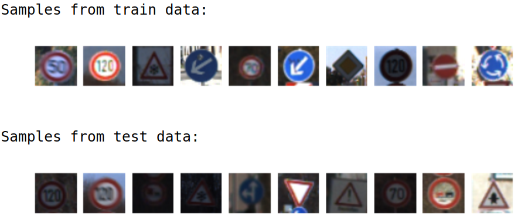
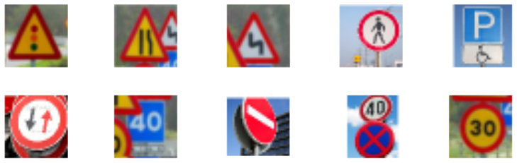

# Traffic Signs Classification NN

Neural Network implementation in Python (Jupyter Notebook) using TensorFlow to classify traffic Signs from German dataset (gtsdb)

# Instructions

Deep Learning
Project: Build a Traffic Sign Recognition Classifier
In this notebook, a template is provided for you to implement your functionality in stages which is required to successfully complete this project. If additional code is required that cannot be included in the notebook, be sure that the Python code is successfully imported and included in your submission, if necessary. Sections that begin with 'Implementation' in the header indicate where you should begin your implementation for your project. Note that some sections of implementation are optional, and will be marked with 'Optional' in the header.
In addition to implementing code, there will be questions that you must answer which relate to the project and your implementation. Each section where you will answer a question is preceded by a 'Question' header. Carefully read each question and provide thorough answers in the following text boxes that begin with 'Answer:'. Your project submission will be evaluated based on your answers to each of the questions and the implementation you provide.

Step 1: Dataset Exploration
Visualize the German Traffic Signs Dataset. This is open ended, some suggestions include: plotting traffic signs images, plotting the count of each sign, etc. Be creative!
The pickled data is a dictionary with 4 key/value pairs:
features -> the images pixel values, (width, height, channels)
labels -> the label of the traffic sign
sizes -> the original width and height of the image, (width, height)
coords -> coordinates of a bounding box around the sign in the image, (x1, y1, x2, y2). Based the original image (not the resized version).

Step 2: Design and Test a Model Architecture
Design and implement a deep learning model that learns to recognize traffic signs. Train and test your model on the German Traffic Sign Dataset.
There are various aspects to consider when thinking about this problem:
Your model can be derived from a deep feedforward net or a deep convolutional network.
Play around preprocessing techniques (normalization, rgb to grayscale, etc)
Number of examples per label (some have more than others).
Generate fake data.
Here is an example of a published baseline model on this problem. It's not required to be familiar with the approach used in the paper but, it's good practice to try to read papers like these.

# Implementation and Results

## Preprocessing the data.

The convertion to grayscale images reduces the complexity of the data while retaining the interesting features like shapes and symbols. If we, humans, are able to label the traffic sign with this reduced information, we expect the neural network to be also able to do it. In fact, reducing the dimensionality from 3 colors to 1, besides making it much more efficient and easier to train, can potentially increase the performance as the color is sometimes source of problems and causing "distraction". The structure of the data is kept and complexity is reduced.
Images were converted to grayscale by using the rgb2gray function. In order to further improve the preprocessing of the dataset, the mean was brought to about zero by subtracting 128 to the pixel value. Also, values were normalised to small values betweeen -1 and 1 by dividing by 128.
Other methods could be used to preprocess the data such as adjusting the contrast and brightness or aplying Gaussian blur, but I'm not sure if that would really be of benefit to the convolutional neural network. As such I decided to use just the simplest and probably the most useful techniques: RGB to grayscale convertion, zero mean and normalisation to small values.

## Setting up training, validation and testing data

All the images of the dataset should be of equal size and in order to be able to use them together with the provided dataset they should be of same size (32x32) and image color depth (3). In fact, since at this point we already preprocees the original dataset and we have now only gray images, there is only one dimension for color depth. I've separated the data in 3 sets: training, test and validation data. The validation set was taken from the original training set. A fraction of 10% of that original training set is now the validation set and the remaining 90% is still part of the training data. The testing data is bigger than the validation set and should account for almost 30% of the total dataset. I have split both the data images and the labels using the train_test_split function.
As we used the preprocesses images we don't need to apply the same preprocessing techniques, rgb to grayscale conversion and make the mean zero, because they are already in the correct format.

## Architecture

The Architecture is as follows:

1) Convolution 1: input = 32x32x1; feature map = 1; patch = (5x5); stride = (1,1); (S=1) padding = "SAME" of size 1 (P=1) output depth = 32; output = 30x30x32;
Max Pooling (down-sampling): stride = (2,2); (S=2) output = 15x15x32;
num_params = (5x5x1+1)x32 = 832

2) Convolution 2: input = 15x15x32; feature map = 1; patch = (5x5); stride = (1,1); (S=1) padding = "SAME" of size 1 (P=1) output depth = 64; output = 13x13x64;
Max Pooling (down-sampling): stride = (2,2); output = 7x7x64;
num_params = (5x5x1+1)x64 = 1664

3) Convolution 3: input = 7x7x64; feature map = 1; patch = (5x5); stride = (1,1); (S=1) padding = "SAME" of size 1 output depth = 128; output = 5x5x128;
Max Pooling (down-sampling): stride = (2,2); output = 3x3x128;
num_params = (5x5x1+1)x128 = 3328

4) Fully connected layer_1: number of layers = 256; input = 1152x1 (33128); output = 256x1;
Relu activator:
output = 256x1;

num_params = (1152*256) = 294912
5) Fully connected layer 2: number of layers = 256; input = 256x1; output = 256x1;
Relu activator:
output = 256x1;

Apply Dropout:
keep_prob = 0.75 (meaning 25% are dropped each iteration);

Flatten layer;

num_params = (256*256) = 65536
6) Output Prediction Input = 256x1; Output = 43x1 (43 classes);
num_params = (256*43) = 11008

## Training the model (Type of optimizer, batch size, epochs, hyperparameters, etc.)

I used a gradient descent optimizer with the following parameters (names are self explanatory):
learning_rate = 0.05
training_iters = 50
batch_size = 128
display_step = 1
keep_prob = 0.75 (for dropout implementation, avoiding overfitting)
To select the learning rate I first experimented with a value of 0.001. I was not seeing fast progress for the accuracy so I decided to make it slightly larger in order to converge faster to higher accuracies. Of course, have a larger learning rate also means that when we are already at high accuracies, it is much more difficult to improve the results further. Ideally we would want to make the learning rate variable and decreasing as the number of iterations increase. I selected the same batch size used in the examples. I don't have a very strong reason why should we choose this particular number for the batch size except for the fact that this value should be big enough to accomodate a significant number of random samples and also small enough to enable the training to take place in a reduced amount of time. The number of training iterations was such that would allow me to get very low cost values and also high accuracy results in a relatively short period of training time. By looking at the results now I would probably reduce it to about 30 or 35 iterations. We can see clearly that after 30 iterations the learning rate should be lower in order to allow smoother transitions and avoid the cost to fluctuate a lot for small values. The keep probability value was chosen to be 0.75 in order to avoid overfitting and increase robustness by creating redundancies in the nn. 0.75 seems a reasonable value in the sense that we still have 75% of the neurons active for a particular layer and 25% are randomly silenced during one training iteration. Having smaller values (e.g. 0.5) would make it more robust but probably it will take more time to converge.

## Approach to find solution to this problem?

I tried using a convolutional neural network because it is best suited to handle statistical invariance for features in images wich might not be properly aligned and centered in the image. For this I used 3 layers of CNNs. I also wanted to make my model deeper and more capable of handling more complicated problems. As such I included 2 aditional hidden layers of fully connected nn. These layers include Relu units (to make it useful for non-linear problems) and also the dropout technique which helps preventing overfitting and makes the NN more robust as it favours redundancy. I chose to have 3 CNN layers as it enables us to have 3 different levels of hierarchichal representations. As an example, the first layer would detect simple lines and curves, the second layer could include representation of connected lines, circles, triangles and squares and the third layer could already include a higher level discrimination of things like numbers and symbols. For each additional layer we add to the nn architecture we are increasing the complexity and therefore sensible decision has to be made on whereas or not including these extra layers would really improve the performance. I have to say I didn't test other architectures and I did choose to go along with this particular one because at this stage (of y learning process) I was more interested to gain understanding on how the nn works and if I could include extra layers and make it work, rather than focus on getting the most efficient architecture. In addition to these ideas I found that the architecture of the paper referenced in the course for traffic classification is very interesting and produced really good results. My architecture follows part of that structure.
Step 3: Test a Model on New Images
Take several pictures of traffic signs that you find on the web or around you (at least five), and run them through your classifier on your computer to produce example results. The classifier might not recognize some local signs but it could prove interesting nonetheless.
You may find signnames.csv useful as it contains mappings from the class id (integer) to the actual sign name.
Implementation
Use the code cell (or multiple code cells, if necessary) to implement the first step of your project. Once you have completed your implementation and are satisfied with the results, be sure to thoroughly answer the questions that follow.

## Challenging images for classification

Answer: I actually provided ten images. See answer above. From these images there are many challenges:
The 'parking.png', '2signs.png' and 'narrow.png' present two signs;
The 'priority.png' is partially cut and in this case the color really matters in order to distinguish which vehicle has the priority.
The 'curves.png' and '40.png' are partially occluded by other signs;
The 'noWalking.png' is not centered;
The 'noWay.png' is tilted.

## Real captured images Vs Testing images from dataset

Unfortunatelly my model doesn't perform as well on these captured images. Only 3 out of 10 were correctly labeled.
The prediction accuracy of the result is 30% for this particular set of examples. Previously we've seen that the accuracy on the validation set was about 99% and on the test set about 92%. Both these values are much higher than the one we got (30%) in this particular case. The justification for this might lie partially in one hand, on the particular challenges these images impose (which have already been pointed out in question 6), and on the other hand, related to the original dataset which may not include representation of some of these new images. There is also a chance that the architecture and training method was not the most adequate and therefore the network outputs some false positive and false negative results.

## Model's softmax probabilities visualization

It is interesting to observe that for those images correctly labeled ('lights.png', 'narrow.png', 'curves.png') the certainty is very high (except for the 'lights.png' where it's only about 0.7 probability). It is even more interesting (and worring) to observe that 5 of these images (parking.png, 30.png, noWay.png, noWalking.png and priority.png) were incorrectly labeled with a very high certainty! For all the incorrectly labeled images the correct prediction doesn't appear in the first three results. This means that either our training data is not sufficient (quantity and diversity) to be able to correctly classify these images, or the classes (for some of these images this is the case) are not represented in the initial set.
Question 9
If necessary, provide documentation for how an interface was built for your model to load and classify newly-acquired images.
Answer:
The provided images were previously resized to meet the same dimensions 32x32 pixels. These images were imported using standard opencv functions, like imread to read the file and cvtColor to convert the color format to RGB. These images then went to through the same preprocessing as the training set, i.e., conversion to grayscale, zero mean and normalisation. The classification was done using the softmax and previously determined logits on this new collection of images.

Result example

